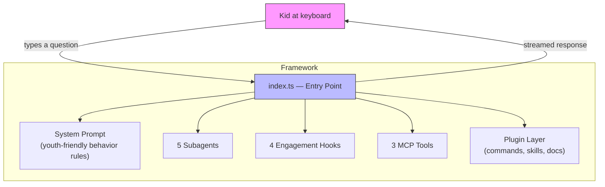
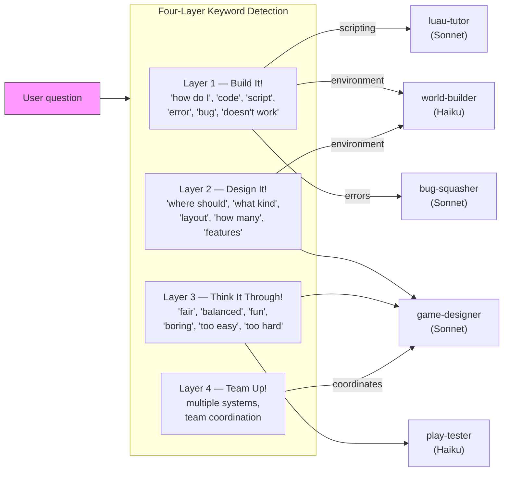
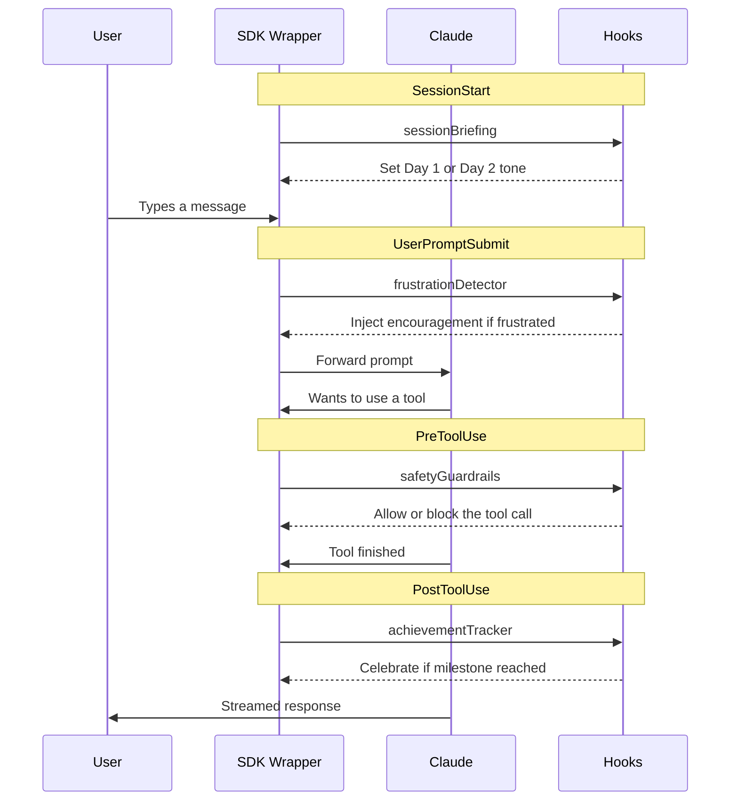

# Architecture Overview

The Youth Game Dev Framework is a Claude-powered AI mentoring system for kids building Roblox games. It runs in two modes — as a **Claude Code plugin** (Option A) or as a **Claude Agent SDK wrapper** (Option B) — but both share the same core design.

## System Overview

In **Plugin mode** (Option A), the user runs `claude` directly and loads the `plugin/` folder. Claude Code handles routing, and the plugin provides agents, commands, skills, docs, and a shell-based safety hook.

In **SDK mode** (Option B), `src/index.ts` orchestrates everything: it builds a system prompt, registers agents and hooks, starts an MCP tool server, loads the plugin, and runs a conversation loop with session persistence.

## Agent Routing

When a kid asks a question, the system uses a four-layer cognitive hierarchy to route it to the right agent.

## Hook Lifecycle

The SDK wrapper (Option B) uses four hook events to enhance the experience. Each hook fires at a specific point in the conversation lifecycle.

## Agents

| Agent | Role | Model | Tools | Layers |
|-------|------|-------|-------|--------|
| **game-designer** | Brainstorming, mechanics, feature planning | Sonnet | Read, Glob, Grep, Write | 2–3 |
| **luau-tutor** | Teaching Luau scripting, writing code | Sonnet | Read, Write, Edit, Bash, Glob, Grep | 1 |
| **world-builder** | Environment design, terrain, lighting | Haiku | Read, Write, Glob | 1–2 |
| **bug-squasher** | Debugging and fixing errors | Sonnet | Read, Grep, Glob, Edit, Bash | 1 |
| **play-tester** | Game feel evaluation, playtesting guidance | Haiku | Read, Glob, Grep | 3 |

The orchestrator (main Claude instance) runs on **Sonnet** and delegates to subagents via the Task tool. Haiku is used for agents that don't need heavy reasoning (world-builder, play-tester), keeping latency low and cost down.

## MCP Tools

The SDK wrapper runs a custom MCP server (`roblox-dev-tools`) with three tools:

| Tool | What It Does |
|------|-------------|
| **check_luau_syntax** | Basic Luau syntax validation — catches mismatched brackets, unbalanced block keywords (`do`/`end`, `repeat`/`until`), common typos (`funtcion`, `===`), and JavaScript-isms (`!==`). Runs before the kid pastes code into Studio. |
| **update_progress** | Appends an entry to the team progress board (`progress-board.md`). Tracks who did what and what's next, formatted as a markdown table. |
| **roblox_snippet** | Generates common Roblox code patterns (touch-to-collect, click-to-buy, leaderboard, round-system, etc.) with explanations and customization tips. 10 patterns available. |

## Session Persistence

The framework supports multi-day hackathons with automatic session saving.

**Day 1:** When the kid quits (via `/quit` or Ctrl+D), the session state is written to `session-state.json` — including the Claude Agent SDK session ID, team name, game name, and the current day.

**Day 2:** Running with `--resume` loads the saved state, detects that it's a new calendar day, and sets the tone to "Ship It Day!" The SDK resumes the previous Claude conversation so the AI remembers everything from Day 1.

Day detection logic:
- No saved state → Day 1
- Saved state from a different calendar day → Day 2
- Saved state from today → same day (resume in progress)
